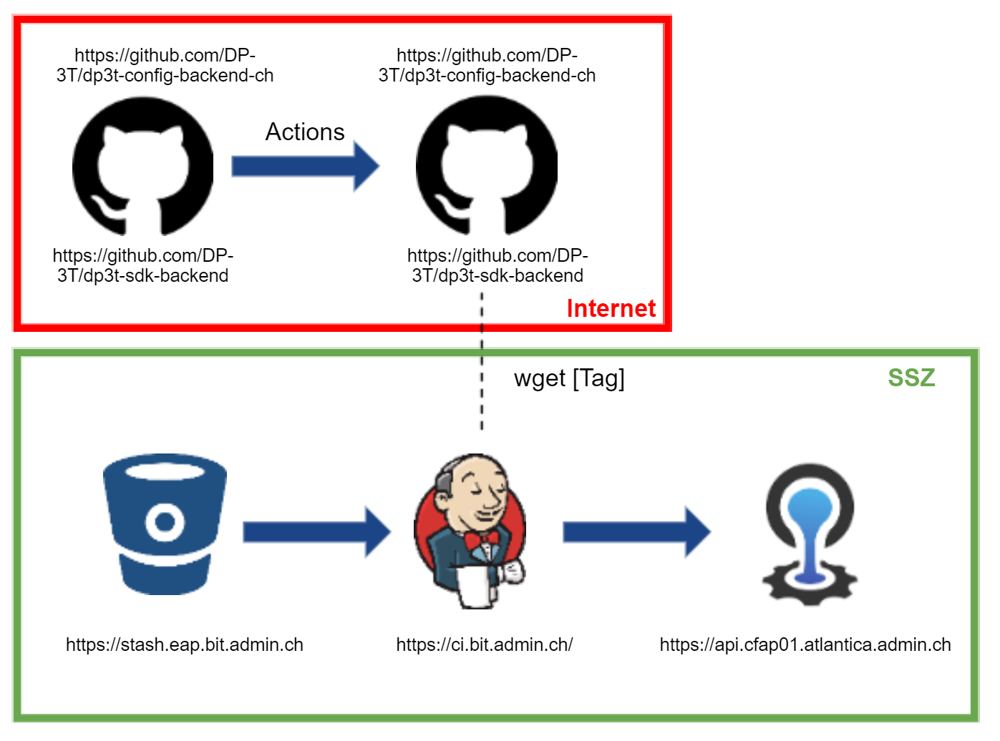

Overview of the CI/CD Process of the Swiss Proximity Tracing System (PT-S)
==========================================================================
This document gives an overview over the CI/CD process used to deploy the black backend/frontend, red backend and red config service. To produce reproducible builds either the io.github.zlika maven plugin is used or a hash is computed over the static files (see the respective repositories for more details).

Federal IT Steering Unit Network Policies
-----------------------------------------
As described in the [system overview](overview.md) the architecture is based on the network zone policy concept of the Federal IT Steering Unit (FITSU, https://www.isb.admin.ch/) - [Official Document](https://www.isb.admin.ch/dam/isb/de/dokumente/ikt-vorgaben/sicherheit/si003/Si003-Netzwerksicherheit_in_der_Bundesverwaltung_V2-0-d.pdf.download.pdf/Si003-Netzwerksicherheit_in_der_Bundesverwaltung_V2-0-d.pdf) - as well as the access matrix - [Official Document](https://www.isb.admin.ch/isb/de/home/ikt-vorgaben/sicherheit/si002-ikt-grundschutz_in_der_bundesverwaltung.html). As a result of these policies, it is not possible to deploy directly from GitHub (Internet zone) to the SSZ (Shared Server Zone) zone.

Consequently we cannot directly deploy the artifacts in the public GitHub repositories to the Federal Office of Information Technology, Systems and Telecommunication (FOITT) PaaS platform but we have to pull either the code or the build artifacts and then deploy it from the FOITT internal infrastructure.

CI/CD Pipeline for Black Backend
--------------------------------
For the black backend we have a step build and deployment process with a pipeline on GitHub and other open build components (Travis-CI and SonarCloud) bound togteher with Github Actions. For security reasons - so that nobody on GitHub side can temper with the build artifacts before they are deployed to the FOITT PaaS - we clone the sourcecode from GitHub and build the artifacts again internally and also run security, regression tests and quality scans. 

Fig 1: CI/CD Process Black Backend

CI/CD Pipeline for Black Frontend
---------------------------------
The black frontend is basically the same process as the backend with difference that here we only have static files so we did not mirror the build process with the open build components of the black backend.

Fig 2: CI/CD Process Black Frontend

CI/CD Pipeline for Red Backend and Config Service
-------------------------------------------------
The DP3T artifacts (red side) are developed and build by Ubique in their repositories and these are used directly for the deplyoment on the FOITT PaaS as depictured on the following diagram: 

Fig 3: CI/CD Process Red Backend and Config Service

